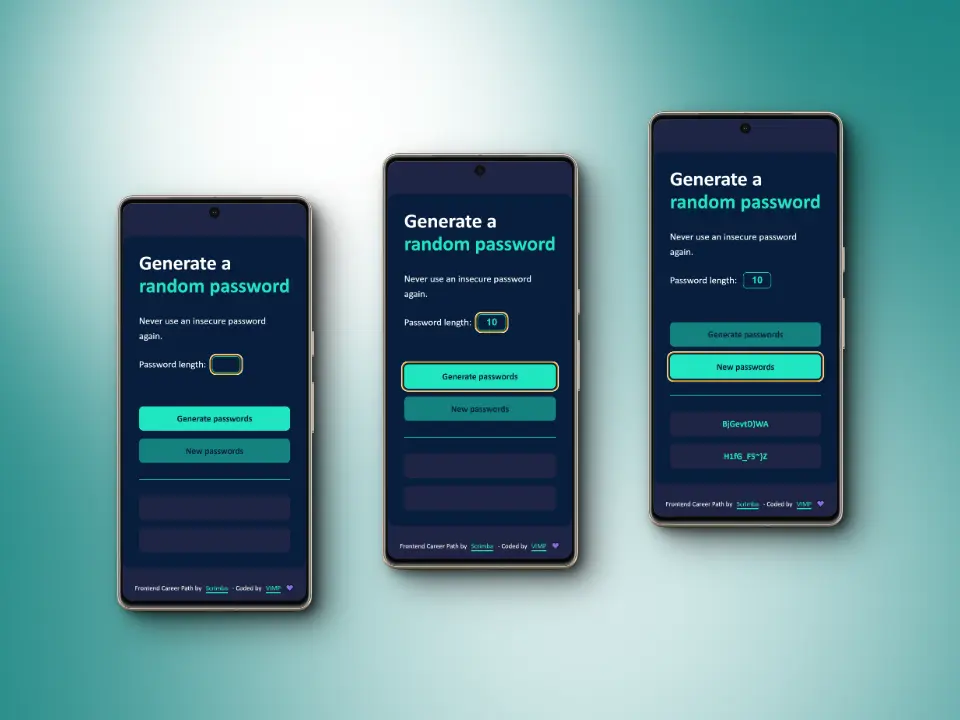
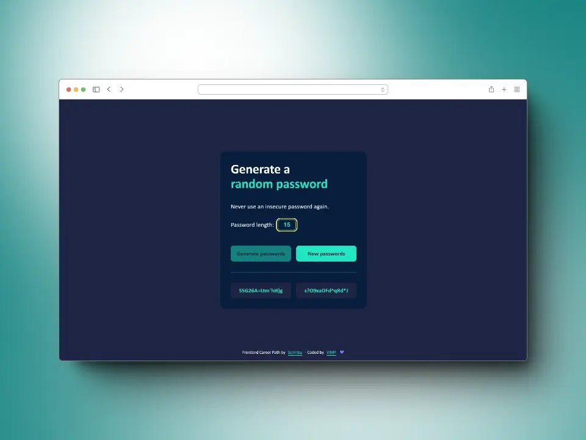

# Password Generator - Solo Project

This is my solution to the Solo project: Password Generator of the course [Frontend Career Path](https://scrimba.com/learn/frontend) by [Scrimba](https://scrimba.com/).


### Table of contents

+ [The challenge](#the-challenge)
+ [Screenshots](#screenshots)
+ [Links](#links)
+ [Built with](#built-with)
+ [What I learnt](#what-i-learnt)
+ [Useful resources](#useful-resources)
+ [Author](#author)

## *The challenge*

🎯 Build it from "scratch"

🎯 Generate two random passwords when the user clicks the button

🎯 Ability to set password length

🎯 Each password must have a minimum of 15 characters long

## *Screenshots*

### 📱 Mobile



### 💻 Desktop



## *Links*

[Live site](https://mendez-v.github.io/password-generator/) 👀

[Scrim URL](https://scrimba.com/scrim/cENKGruK) 👀

[See my FCP projects](https://github.com/mendez-v/frontend-career-path) 👀

## *Built with*

✅ Mobile-first workflow

✅ Semantic HTML markup

✅ Custom properites

✅ Flexbox

✅ CSS Grid

## *What I learnt*

🎇 `Math.random()` and `Math.floor()`
```js
function randomIndex() {
  return Math.floor( Math.random() * characters.length )
}
```
🎇 `setAttribute()` and `removeAttribute()`
```js
generateBtn.setAttribute("disabled", "")
newBtn.removeAttribute("disabled")
```

🎇 Disable `input[number]` buttons
```css
/* Chrome, Safari, Edge, Opera */
input::-webkit-outer-spin-button,
input::-webkit-inner-spin-button {
  -webkit-appearance: none;
  margin: 0;
}

/* Firefox */
input[type=number] {
  -moz-appearance: textfield;
  appearance: textfield;
}
```

## *Useful resources*

🌈 Favicon - <a href="https://iconscout.com/icons/password" class="text-underline font-size-sm" target="_blank">Password</a> by <a href="https://iconscout.com/contributors/AmruID" class="text-underline font-size-sm" target="_blank">Amru Id</a>

## *Author*

✨ Frontend Mentor - [@mendez-v](https://www.frontendmentor.io/profile/mendez-v)

